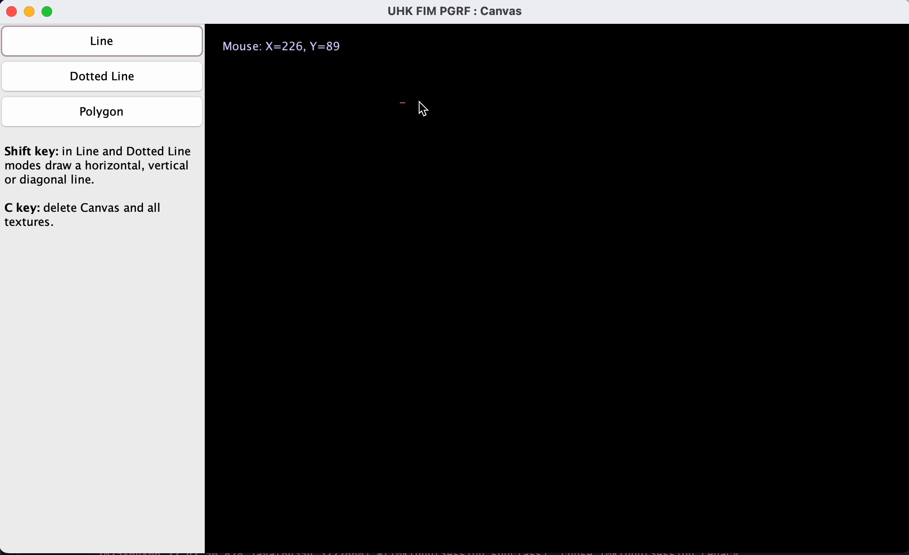

# 🎨 Canvas Drawing Project

**Author:** Nadezhda Grishina  
**Version:** 2023

---

## 🧩 Description

The **Canvas Drawing Project** is a Java Swing-based desktop application that allows users to interactively draw lines and polygons on a digital canvas.  
Ideal for exploring basic computer graphics and user interface design in Java.

---

## 🚀 Features

- 🖊️ **Regular lines** – Click and drag to draw straight lines.
- 🎯 **Dotted lines** – Create stylish dotted lines.
- 🔺 **Polygons** – Connect multiple points to form polygons.
- 🧹 **Clear canvas** – Press **`C`** to clear all drawings.
- 🔄 **Shift key support** – Hold **`Shift`** to draw horizontal, vertical, or 45° diagonal lines.

---

> ✨ Live demo below ↓



---

## 🛠️ Installation

1. Clone the repository:
   ```bash
   git clone https://github.com/nadyagrishina/canvas-drawing-project.git
